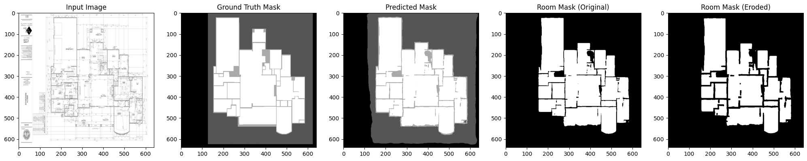
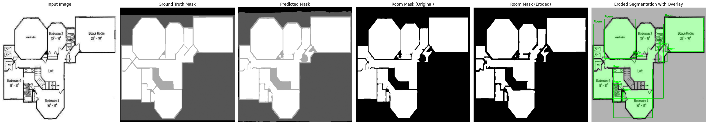

# Floor Plan Room Semantic Segmentation

## Overview
This project focuses on semantic segmentation of floor plans using deep learning techniques. The model classifies different components of a floor plan such as rooms, walls, doors, and windows using a U-Net architecture with a ResNet encoder. The dataset comprises floor plan images and corresponding segmentation masks, which are preprocessed and augmented for training.

## Features
- **Deep Learning Architecture**: Implements **U-Net** with **ResNet** encoder using `segmentation_models_pytorch`.
- **Advanced Data Augmentation**: Utilizes **Albumentations** for enhancing dataset robustness.
- **K-Fold Cross-Validation**: Ensures reliable model performance evaluation.
- **Comprehensive Metrics**: Evaluates model performance using **Precision, Recall, F1-Score, Dice Score, and Mean Average Precision (mAP)**.
- **Instance Detection**: Extracts room instances with **bounding box generation and confidence scoring**.
- **Visual Analysis Tools**: Enables debugging via detailed image comparisons.
- **Training Optimizations**: Implements **early stopping** and **learning rate scheduling**.

## Installation
### Dependencies
Ensure the necessary dependencies are installed:
```bash
pip install segmentation-models-pytorch albumentations opencv-python numba torch torchvision numpy matplotlib scipy
```

## Dataset Structure
The dataset should be structured as follows:
```
mask-semantic/
│── images/            # Raw input images
│── masks/             # Corresponding segmentation masks
│── train_images/      # Training images
│── train_masks/       # Training masks
│── val_images/        # Validation images
│── val_masks/         # Validation masks
│── test_images/       # Testing images
│── test_masks/        # Testing masks
│── _classes.csv       # Class definitions (Pixel Value, Class Name)
```

## Training Pipeline
### 1. Data Preparation
- Parses `_classes.csv` to map pixel values to class indices.
- Loads images and masks into PyTorch **Dataset** and **DataLoader**.
- Applies augmentation transforms for improved generalization.

### 2. Model Selection
- Utilizes `segmentation_models_pytorch` with the **U-Net** architecture.
- Supports multiple encoders: EfficientNet, ResNet, PSPNet, DeepLabV3+.
- Dynamically initializes with the detected number of classes.

### 3. Training Configuration
- Uses **CrossEntropyLoss** for multi-class segmentation.
- Optimized with **Adam optimizer** and adaptive learning rate scheduling.
- Performance evaluation through **Dice coefficient, Precision, Recall, F1-Score, and Accuracy**.
- Implements **early stopping** based on validation loss improvement.

### 4. K-Fold Cross-Validation
- Uses **5-Fold cross-validation** to improve model generalization.
- Saves best-performing models based on validation scores.

## Evaluation & Metrics
- **Pixel-wise Accuracy**: Measures correct pixel classification.
- **Dice Score**: Evaluates overlap between predictions and ground truth.
- **Precision, Recall, F1-Score**: Quantifies model reliability.
- **Confusion Matrix**: Analyzes per-class performance.
- **mAP (Mean Average Precision)**: Calculates detection performance across IoU thresholds.

## Room Detection & Bounding Boxes
- Loads trained model weights from a `.pth` file.
- Extracts **connected components** for `room` class.
- Generates **bounding boxes and confidence scores**.
- Saves results as **JSON output**.

### Example Output
```json
{
  "predictions": [
    {
      "x": 320.5,
      "y": 240.2,
      "width": 150.0,
      "height": 120.0,
      "confidence": 0.85,
      "class": "room",
      "class_id": 3,
      "detection_id": "abc123-uuid"
    }
  ]
}
```

## Visualization & Debugging
- Displays **input images, ground truth masks, and predicted masks**.
- Highlights **room instances with bounding boxes**.
- Applies **morphological erosion** for mask refinement.
- Supports **interactive visualization** using Matplotlib.

## Predicted Rooms with Erosion Operation


## Segmented Rooms



## Model Checkpointing
```python
# Save trained model
torch.save(model.state_dict(), "unet_floorplan_multiclass.pth")

# Load trained model
model.load_state_dict(torch.load("unet_floorplan_multiclass.pth"))
model.eval()
```

## Performance Summary
- The model achieves high **Dice scores** and 93.59% **mAP** for room segmentation.
- Visualization techniques provide insights into error patterns.

## Future Improvements
- Train with larger, more diverse datasets.
- Experiment with **self-supervised pretraining**.
- Implement **active learning** for enhanced annotations.

## License
MIT License
